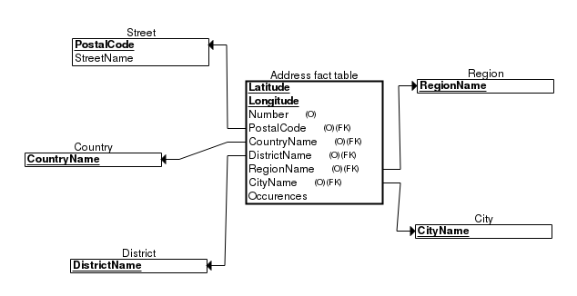

# Avaliação Técnica

## Organização de classes/arquivos
* _GeoParser_, contida no arquivo _geoparse.py_ é uma classe que, basicamente, faz o processamento das linhas do arquivo. Ela faz isso possivelmente com qualquer linha de tenha a sintaxe no formato DMS (Degrees Minutes Seconds). Ao ter todos os dados (Latitude, Longitude e Altitude), ela possui um método para retornar um *Point*, formato do GeoPy para pontos geográficos.
* _PointLocator_, contida no arquivo _pointlocator.py_ é uma classe que, dado um ponto no formato Point do GeoPy, pode localizá-lo. Ela utiliza o Geocoder ArcGIS, o qual permite um número de requisições por mês gratuitamente. Todos os outros Geocoders (inclusive o do google maps v3) necessitam de pagamento e, como o enunciado prevê o uso apenas de tecnologias opensourse, isso foi o mais próximo disso que consegui encontrar.
* _Address_, contida no arquivo _address.py_ é uma classe que extrai os dados requisitados de um objeto Location (geopy). Ela também é responsável pela geração dos SQL's para persistir seus objetos.
* _DatabaseService_, contida no arquivo _database.py_ é uma classe que intermedia as interações (inserts e queries) com o BD.
* No arquivo _extract_data.py_ está implementada toda a lógica de negócio para ler os dados dos arquivos, gerar pontos geográficos a partir deles, obter sua localização (informações como rua, CEP, cidade, etc.) e armazená-los no banco de dados
* O arquivo _visualize_extracted_data.py_ carrega o banco e mostra algumas visualizações. Fiz poucas mais por questão de tempo mesmo.
---

## Extração das Coordenadas dos arquivos - Premissas
* Identificado que o arquivo nem sempre segue o padrão Latitude, Longitude, Altitude. Isso pode ser ou característico do sistema, ou um erro na geração do arquivo. Considerando que pode ser erro na geração do arquivo, identificaram-se poucos casos com esse comportamento (menos de 1 dezena no arquivo 20180101).
* Devido ao ponto citado acima, o leitor do arquivo (extract_data.py) foi desenvolvido como uma máquina de estados (LAT -> LON -> ALT) para evitar erros de consistência. Notar que, com isso, presume-se que todos os dados no formato LAT -> LON -> ALT estão corretos, registros fora dessa ordem são descartados.
* Considerou-se que um ponto pode se repetir (imagine que esses são os dados de visitas em clientes, um cliente pode ter sido visitado mais de uma vez).
---

## Banco de dados
* Tendo em vista que esse é apenas um projeto de demonstração de capacidades, optei por utilizar sqlite como RDBMS.
* Alguns comandos do banco:
    - Em uma linha de comando, execute sqlite3, se houver instalado esse comando inicia um processo do sqlite no console. Para finalizar, ctrl + C.
    - Se precisar instalar, _sudo apt-get install sqlite3_.
    - Para criar o banco, no diretório data deste zip, digite _sqlite3 <database_name>.db < create_database.sql_.
    - Para acessar o banco, basta executar _sqlite3 <database_name>.db_.
* Dependendo da possibilidade de reutilização do banco, talvez o ideal fosse utilizar um framework de mapeamento objeto-relacional (ORM), como o SQLAlchemy.

### Estrutura do Banco

Optei por estruturar o banco em uma arquitetura no formato estrela (star schema). É o formato mais simples de um data mart, com o objetivo de poder plugar uma aplicação OLAP depois para poder explorar os dados. A estrutura do banco ficou da seguinte forma:

Para fazer essa estrutura, foi utilizado a solução online ERDPlus.
Ela gera o SQL diretamente do diagrama (o sql para a criação do banco está localizado em data/create_database.sql)

---

## Utilizou-se...
* Python 3.7
* Bibliotecas Python
    * [GeoPy](https://geopy.readthedocs.io), para instalar _pip install geopy_
    * [Pandas](https://pandas.pydata.org/), para manipulação de dados. Para instalar, _pip install pandas_ ou _conda install pandas_ se utilizar o ambiente Anaconda.
    * [MatPlotLib](https://matplotlib.org/), como base para visualização. Para instalar, _pip install matplotlib_ ou _conda install matplotlib_
    * [Seaborn](https://seaborn.pydata.org/), framework de visualização de dados estatísticos. Para instalar, _pip install seaborn_ ou _conda install seaborn_.
* SQLite

---

# Sobre a implementação
* A GeoPy acaba não retornando dados de distance (altitude ou bearing). Por isso, acabei não armazenando.
* Implementação priorizou simplicidade.
* O ponto mais demorado são as transações com o serviço de coordenadas. Para algo para colocar-se em produção, poderia ser feito um esquema de 1 Producer N Consumers onde o Produtor apenas leria os dados dos arquivos, geraria o ponto geográfico e colocaria em uma queue. Os N consumidores obteriam pontos dessa fila e usariam diferentes geocoders para paralelizar esse ponto.

---

# Bônus
Além do enriquecimento proposto, que análises poderiam ser feitas utilizando essa massa de dados? Que métricas poderiam ser obtidas?

* É difícil ver coordenadas e não pensar em um plot do tipo [Choropleth](https://en.wikipedia.org/wiki/Choropleth_map). Talvez fazer um do estado ou mesmo da cidade de Porto Alegre. Presumindo que isso sejam dados de alguma atuação da empresa no estado, pode-se visualizar os locais onde tem menor número de atuações e melhorar nesse aspecto.
* Talvez fazer uma análise mais analítica sobre os bairros mais presentes, embora haja muitos dados faltantes nesse campo. Talvez tentar obter os dados faltantes seja uma outra atividade que pode ser realizada antes de passar para a análise analítica.
